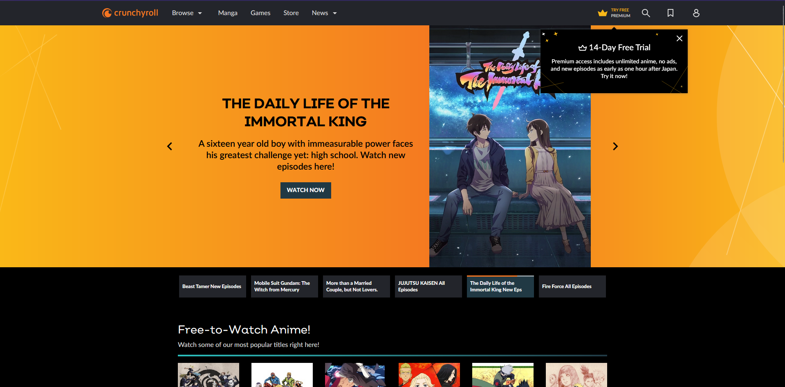
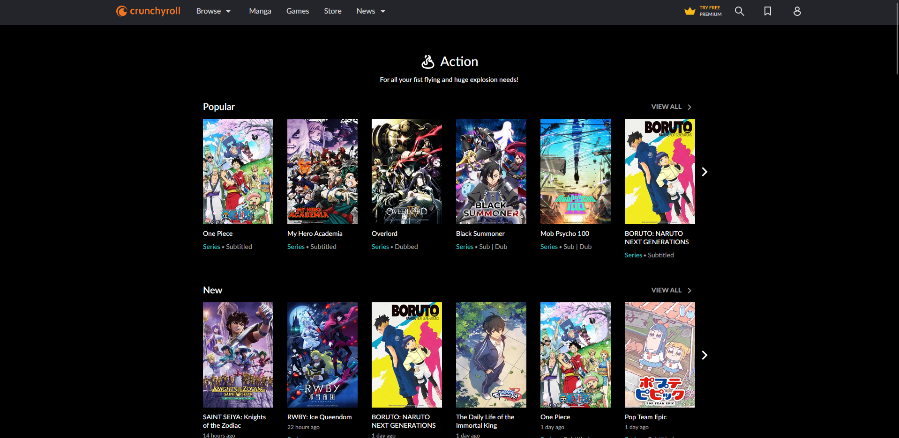
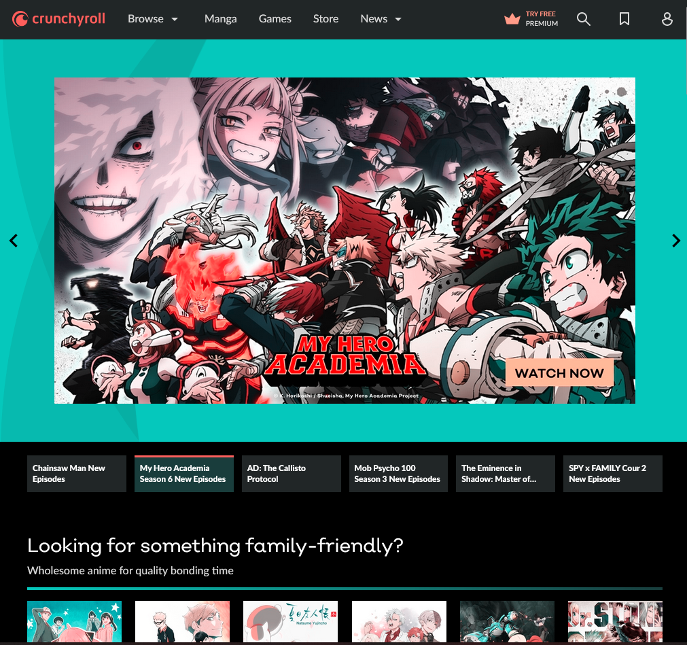
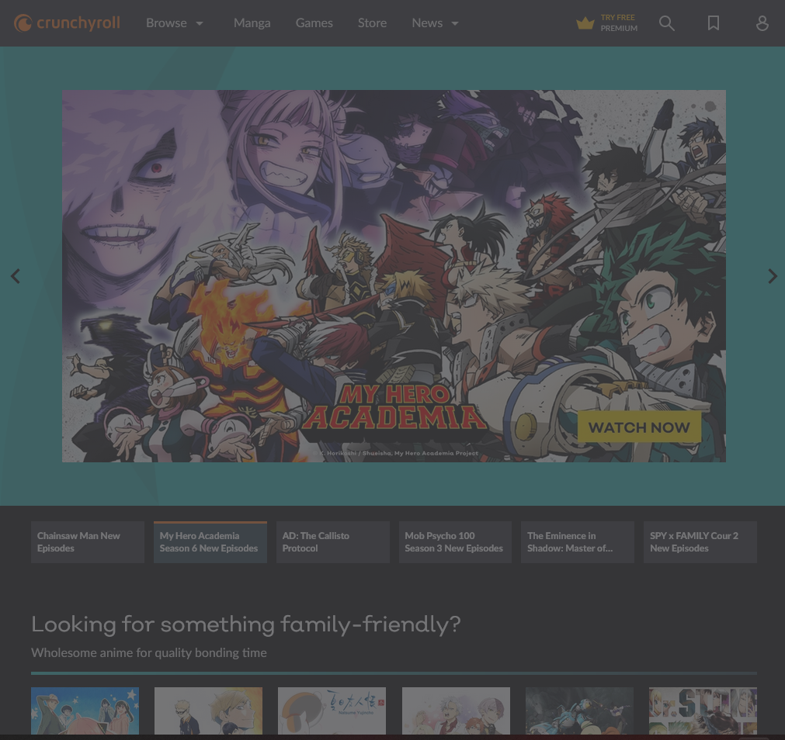

# Procesverslag
Markdown is een simpele manier om HTML te schrijven.  
Markdown cheat cheet: [Hulp bij het schrijven van Markdown](https://github.com/adam-p/markdown-here/wiki/Markdown-Cheatsheet).

Nb. De standaardstructuur en de spartaanse opmaak van de README.md zijn helemaal prima. Het gaat om de inhoud van je procesverslag. Besteedt de tijd voor pracht en praal aan je website.

Nb. Door *open* toe te voegen aan een *details* element kun je deze standaard open zetten. Fijn om dat steeds voor de relevante stuk(ken) te doen.

## Jij

  
uitwerken voor kick-off werkgroep

  ### Auteur:
 Ruben van Vliet

  #### Je startniveau:
  Rode piste

  #### Je focus:
  Surface plane
 

## Je website

  
uitwerken voor kick-off werkgroep

  ### Je opdracht:
  https://www.crunchyroll.com

  #### Screenshot(s) van de eerste pagina (small screen): 
home pagina 
  

  #### Screenshot(s) van de tweede pagina (small screen):
 Genre action pagina
  
 

## Toegankelijkheidstest 1/2 (week 1)

  
uitwerken na test in 1e werkgroep

  ### Bevindingen
  Lijst met je bevindingen die in de test naar voren kwamen:

  #### Screenreader
  Hier korte omschrijving (met indien nodig afbeeldingen)
  
  Ik heb gemerkt dat tijdens het bezoeken van mijn website de screenreader alles op leest en telkens de naam van de website herhaalt als je de Nederlandse verteller aan hebt staan. Maar als je verder gaat op de pagina kom je erachter dat het the volgorde en opbouw vrij logisch is en dat het makkelijk te volgen is. Het is soms nog wel moeilijk om te achterhalen wat nou precies wel en niet een link is, doordat sommige afbeeldingen ook klikbaar zijn en dit niet duidelijk wordt vertelt door de screen reader. Ik heb ook getest met een Engelse verteller  alleen dan leest de engelse verteller wel alle dingen zoals het woord afbeelding vanuit de code wel in het engels uitgesproken, terwijl dit een Nederlands woord is.
  
  Hier een omschrijving van hoe het opgelost kan worden (met indien nodig afbeeldingen)
  
  Je zou eventueel code ook in het engels schrijven om verwarring te voorkomen.
 
  #### Muis en Toetsenbord 
  Hier korte omschrijving (met indien nodig afbeeldingen)
  Dit doen Crunchyroll erg goed, elke state wordt toegepast bij het doorlopen van de website met muis en toetsenbord. Verder is de volgorde van selecteren heel logisch en kan je makkelijk worden doorverwezen naar de gewensde pagina. 

  #### Motoriek (shocks, elastiekjes)
  Hier korte omschrijving (met indien nodig afbeeldingen)
  Ze hebben op de home pagina een caroussel die automatisch doorscrollt dit kan voor mensen vervelend zijn omdat zij kunnen mis klikken en dan vervolgens hun gewilde show missen en dan moeten wachten of terug klikken. 
  
  Een oplossing hiervoor zou zijn de caroussel stop kunnen zetten doormidddel van een pauze knop.

  #### Visueel (brillen, contrast, kleurenblind, dark/light). 
  Hier korte omschrijving (met indien nodig afbeeldingen)
  De website bied verschillende soorten functies aan voor mensen die kleuren blind zijn en is nogsteeds na volgbaar doordat het kleuren contrast op de websote heel nauwkeurig is gedaan. Je kan goed onderscheid maken tussen alle elementen en dit zal voor kleurenblinden geen belemmeringen veroorzaken.
  
   
   

## Breakdownschets (week 1)

  
uitwerken na afloop 2e werkgroep

  
  

## Voortgang 1 (week 2)

  
uitwerken voor 1e voortgang

  ### Stand van zaken
  hier dit ging goed & dit was lastig (neem ook screenshots op van delen van je website en code)

  ### Agenda voor meeting
  samen met je groepje opstellen

  | student 1      | student 2          | student 3    | student 4        |
  | ---            | ---                | ---          | ---              |
  | dit bespreken  | en dit             | en ik dit    | en dan ik dat    |
  | en dat ook nog | dit als er tijd is | nog een punt | dit wil ik zeker |
  | ...            | ...                | ...          | ...              |

  ### Verslag van meeting
  hier na afloop snel de uitkomsten van de meeting vastleggen

  - punt 1
  - punt 2
  - nog een punt
  - ...

## Voortgang 2 (week 3)

  
uitwerken voor 2e voortgang

  ### Stand van zaken
  hier dit ging goed & dit was lastig (neem ook screenshots op van delen van je website en code)

  ### Agenda voor meeting
  samen met je groepje opstellen

  | student 1      | student 2          | student 3    | student 4        |
  | ---            | ---                | ---          | ---              |
  | dit bespreken  | en dit             | en ik dit    | en dan ik dat    |
  | en dat ook nog | dit als er tijd is | nog een punt | dit wil ik zeker |
  | ...            | ...                | ...          | ...              |

  ### Verslag van meeting
  hier na afloop snel de uitkomsten van de meeting vastleggen

  - punt 1
  - punt 2
  - nog een punt
- ...

## Toegankelijkheidstest 2/2 (week 4)

  
uitwerken na test in 8e werkgroep

  ### Bevindingen
  Lijst met je bevindingen die in de test naar voren kwamen (geef ook aan wat er verbeterd is):

  #### Screenreader
  Het lezen van de tekst door de screenreader ging gemakkelijk en was prima te verstaan. Hij leest alleen nog geen plaatjes voor dus dat kan voor blinden nog een probleem zijn. Ook was het geluid van de screenreader best zacht, maar dat komt omdat de speakers van mijn laptop niet top zijn. Met alle headings voorlezen ging zoals het hoorde en ging netjes op volgorde en las de juiste dingen voor, hetzelfde geldt voor de links.

  #### Muis en Toetsenbord 
  Ik kon door mijn website gemakkelijk tabben het enige wat nog ontbreekt is dat als ik iets geselecteerd heb met mijn tab kan je dit nog moeilijk zien/ niet zien. Dus ik moet een focus toevoegen aan alle links en buttons. Ook missen een aantal knoppen en links nog een hover dus die moet ik ook nog toevoegen om mijn website te optimaliseren.

  #### Motoriek (shocks, elastiekjes)
  Naast het feit dat Sanne de hoogste stand bij mij aan deed, merkte ik dat ik met twee fingers controle had over de website maar als je meerdere vingers moet gebruiken dat je dan wel aardig in de problemen kan komen. Voor de rest waren de buttons niet al te moeilijk om te beheersen met de spasmes in je arm en hand. 

  #### Visueel (brillen, contrast, kleurenblind, dark/light). 
  Tijdens het gebruiken van de brillen kwam ik erachter dat de website een vrij goed contrast had waardoor het onderscheiden van bepaalde elementen gemakkelijk afging. Verder voel ik het soms wel lastig om bepaalde dingen te lezen dus daarvoor moet ik kunnen inzoomen op mijn webiste, dat gaat voor groot deel gaat dat goed maar in sommige vlakken kan ik dit op mijn webiste nog beter maken.

## Voortgang 3 (week 4)

  
uitwerken voor 3e voortgang

  ### Stand van zaken
  hier dit ging goed & dit was lastig (neem ook screenshots op van delen van je website en code)

  ### Agenda voor meeting
  samen met je groepje opstellen

  | student 1      | student 2          | student 3    | student 4        |
  | ---            | ---                | ---          | ---              |
  | dit bespreken  | en dit             | en ik dit    | en dan ik dat    |
  | en dat ook nog | dit als er tijd is | nog een punt | dit wil ik zeker |
  | ...            | ...                | ...          | ...              |

  ### Verslag van meeting
  hier na afloop snel de uitkomsten van de meeting vastleggen

  - punt 1
  - punt 2
  - nog een punt
  - ...

## Eindgesprek (week 5)

  
uitwerken voor eindgesprek

  ### Je uitkomst - karakteristiek screenshots:
  

  ### Dit ging goed/Heb ik geleerd: 
  Korte omschrijving met plaatjes

  

  ### Dit was lastig/Is niet gelukt:
  Korte omschrijving met plaatjes

  

## Bronnenlijst

  
continu bijhouden terwijl je werkt

  Nb. Wees specifiek ('css-tricks' als bron is bijv. niet specifiek genoeg).

  1. bron 1
  2. bron 2
  3. ...

